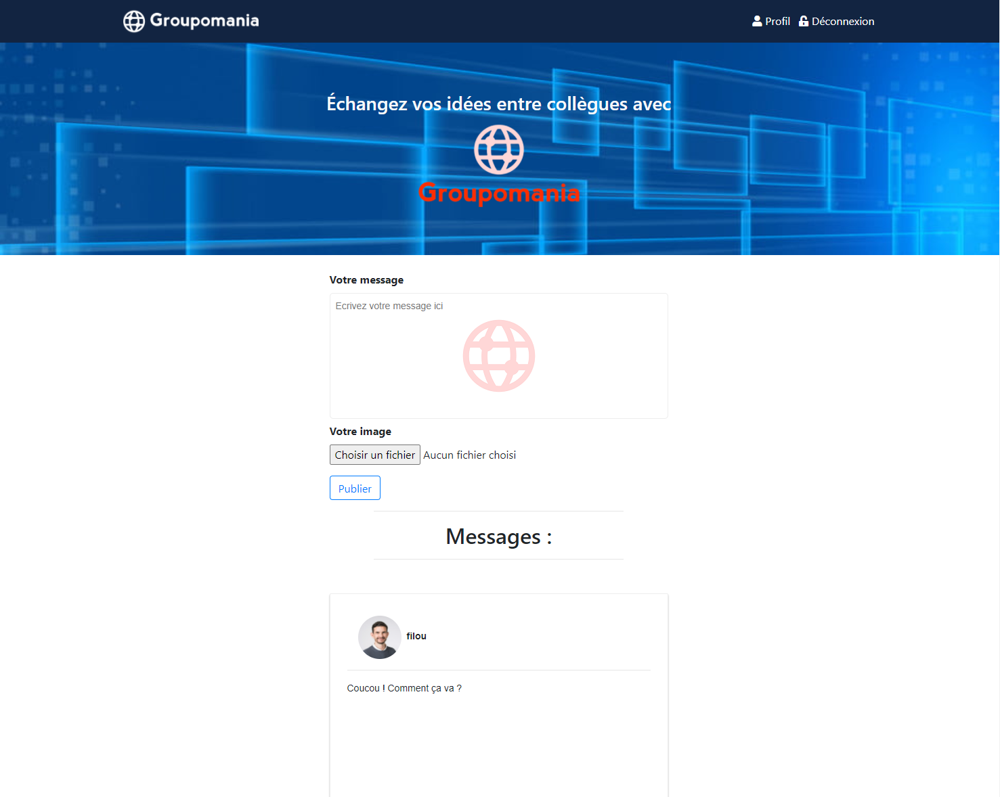

# Projet-7 : Créez un réseau social d’entreprise : Groupomania

<b>Technologies utilisées :</b>

● serveur : NodeJS ; 
● framework : Express ; 
● base de données : MySQL ; 

<b>Procédure :</b>

● Backend :

Créer un base de donnée mysql

Dans le dossier "config" fichier "db.js" rentrer les identifiants de votre base :

    Ex : "const sequelize = new Sequelize(NOM_DE_LA_BD, USERNAME, PASSWORD, {"

Installer les dépendances: "npm install"

Lancer: "nodemon server"

● Frontend :

Dans le dossier "frontend" lancez le fichier "index.html"

<h3>Scénario</h3>
Développement (Frontend et Backend) d'un réseau social d'entreprise pour une société fictive Groupomania.
Une grande liberté est donnée pour développer ce projet: il faut simplement respecter la charte graphique fournie.

<h3>Remarques sur l'évaluation</h3> 
<b>Compétences évaluées</b> 

 

1. Authentifier un utilisateur et maintenir sa session

Validé

2. Implémenter un stockage de données sécurisé en utilisant SQL

Validé

3. Gérer un stockage de données à l'aide de SQL

Validé

4. Personnaliser le contenu envoyé à un client web

Validé

<b>Livrable</b>

 

Les livrables sont en adéquation avec les attentes du projet

Points forts :

Utilisation nodemon et Sequelize

Bonne sécurisation de l’API avec express-rate-limit, Express-sanitize, helmet

<b>Soutenance</b>

Remarques : présentation orale, professionnelle et claire.

Durée : 17min 11

